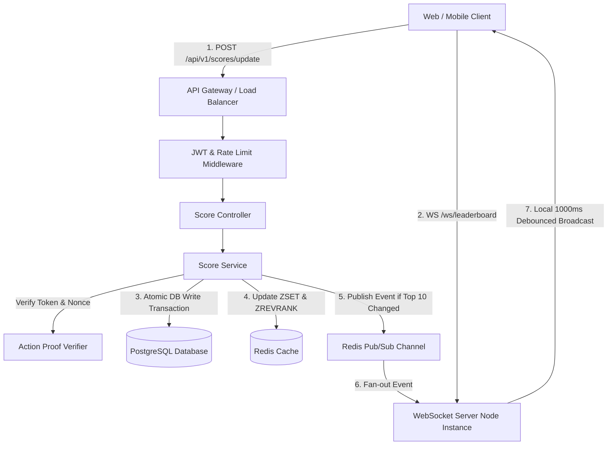
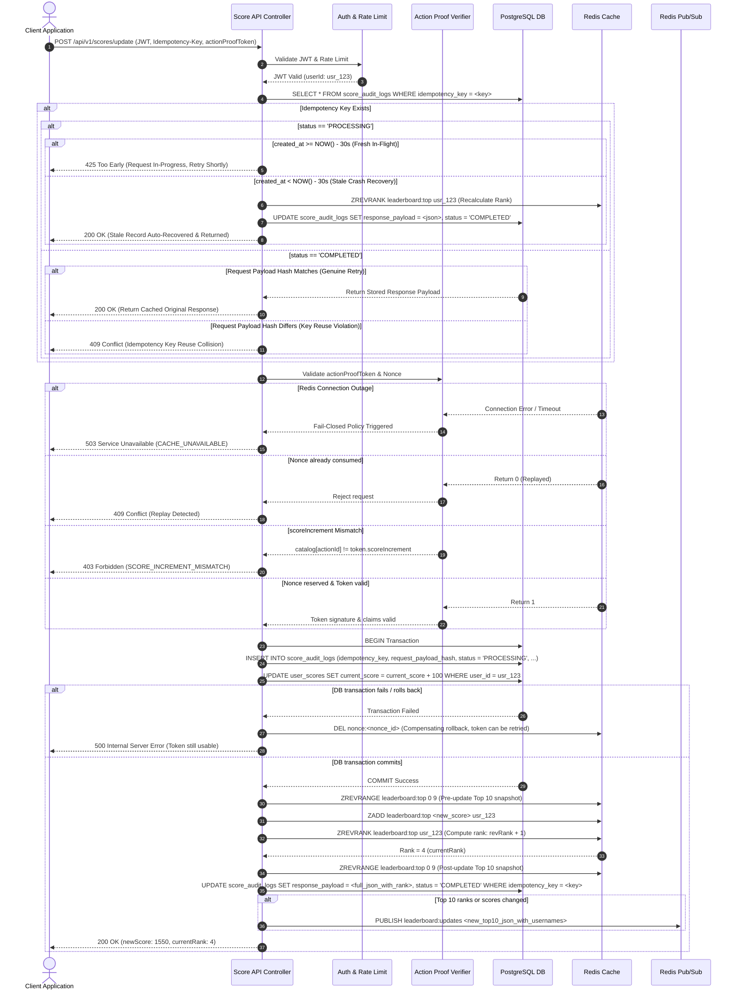
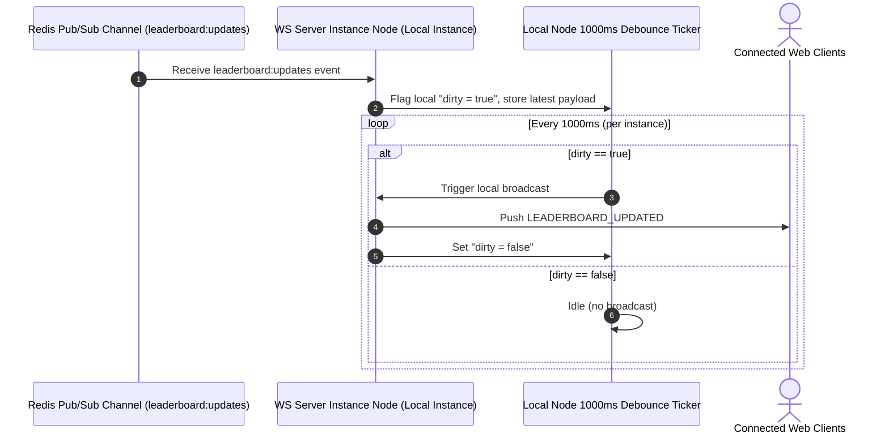

# Live Score Board Module Specification

This document specifies the **Live Score Board API module**, the part of the backend responsible for storing user scores, serving the Top 10 leaderboard, and pushing real-time rank updates to connected clients. It is written for the backend engineering team who will implement it.

---

## 1. Overview & Objectives

The `ScoreBoardService` module handles three core responsibilities: storing user scores, serving the Top 10 leaderboard, and broadcasting live rank changes to every client currently watching the scoreboard.

### Key Objectives
1. **Real-time leaderboard**: Top 10 is always current, available via REST and live via WebSocket.
2. **Secure score updates**: A score only increases when the user actually completed a legitimate action, never just because the client claims it did.
3. **Anti-cheat & anti-replay**: Prevent users from manipulating their own score, whether by tampering with requests or resending old ones.
4. **Scalable & consistent**: Stays stable under heavy concurrent score updates and many simultaneous WebSocket connections.

---

## 2. System Boundaries & Trust Assumptions

To keep ownership clear during implementation, here is exactly what this module does and does not cover:

### In Scope
* Authentication & authorization (JWT and Action Proof tokens).
* Idempotency handling for requests retried due to network issues (TOCTOU-safe with automatic 30s stale `PROCESSING` recovery).
* Replay-attack prevention via single-use nonces with compensating transaction rollbacks and fail-closed Redis policy.
* Data persistence in PostgreSQL and leaderboard caching in Redis (`ZSET`).
* Multi-node WebSocket broadcast infrastructure via Redis Pub/Sub with connection DoS protection.

### Out of Scope (Assumption)
> **Key assumption**: The system that actually runs the user's physical action (e.g. solving a puzzle, completing a stage, finishing a transaction), referred to as the **Action Engine / Game Server**, is **not part of this module**. This API only **receives and verifies** a proof that the Action Engine has already signed. Because of that, this API **never trusts a score value sent directly by the client**; whatever number it sends is simply ignored.

---

## 3. High-Level Architecture

In short: **PostgreSQL** is the source of truth (transactional, ACID), **Redis Sorted Set (`ZSET`)** makes Top 10 queries fast ($O(\log N)$ instead of scanning a table), and **Redis Pub/Sub** keeps every WebSocket server instance aware of score changes across multi-node clusters.

> [!NOTE]
> Diagrams in this specification are defined using **Mermaid.js** (*Diagram-as-Code*). They automatically render into visual vector graphics on GitHub, GitLab, and Markdown editors with Mermaid preview support.



---

## 4. Data Model & Persistence Strategy

### 4.1 PostgreSQL Schema (Source of Truth)

```sql
-- Users table
CREATE TABLE users (
    id UUID PRIMARY KEY DEFAULT gen_random_uuid(),
    username VARCHAR(50) NOT NULL UNIQUE,
    created_at TIMESTAMP WITH TIME ZONE DEFAULT CURRENT_TIMESTAMP
);

-- User scores (current aggregated state)
CREATE TABLE user_scores (
    user_id UUID PRIMARY KEY REFERENCES users(id) ON DELETE CASCADE,
    current_score BIGINT NOT NULL DEFAULT 0,
    updated_at TIMESTAMP WITH TIME ZONE DEFAULT CURRENT_TIMESTAMP
);

CREATE INDEX idx_user_scores_current_score ON user_scores(current_score DESC);

-- Score audit log and idempotency store (immutable transaction history)
CREATE TABLE score_audit_logs (
    id UUID PRIMARY KEY DEFAULT gen_random_uuid(),
    user_id UUID NOT NULL REFERENCES users(id),
    action_id VARCHAR(100) NOT NULL,
    score_increment INT NOT NULL,
    previous_score BIGINT NOT NULL,
    new_score BIGINT NOT NULL,
    idempotency_key VARCHAR(100) NOT NULL UNIQUE,
    request_payload_hash VARCHAR(64) NOT NULL,
    status VARCHAR(20) NOT NULL DEFAULT 'PROCESSING',
    response_payload JSONB DEFAULT NULL,
    created_at TIMESTAMP WITH TIME ZONE DEFAULT CURRENT_TIMESTAMP
);

CREATE INDEX idx_score_audit_logs_user_id ON score_audit_logs(user_id);
```

*Why a separate `score_audit_logs` table instead of just updating `user_scores`?*  
Because `user_scores` only holds current aggregates (fast to read and update), while `score_audit_logs` keeps a full immutable history of every change. It stores the cached response JSON and payload hash to guarantee TOCTOU-safe idempotency handling (see Section 5.2).

### 4.2 Redis Data Structures

1. **Leaderboard Sorted Set (`ZSET`)**:
   * Key: `leaderboard:top`
   * Score: `current_score` (float64)
   * Member: `user_id` (string UUID)
   * Update a score: `ZADD leaderboard:top <current_score> <user_id>`
   * Check user rank: `ZREVRANK leaderboard:top <user_id>` (0-indexed)
   * Get Top 10: `ZREVRANGE leaderboard:top 0 9 WITHSCORES`

2. **Single-use nonce store**:
   * Key: `nonce:<nonce_string>`
   * Value: `1`
   * Expiration: 300 seconds (matches action token TTL)
   * Command: `SET nonce:<nonce_string> 1 NX EX 300`

> **Known technical limitation**: PostgreSQL stores `current_score` as a 64-bit integer (`BIGINT`), while Redis ZSET scores use double-precision floats (`float64`). Float64 stays exact for integers up to $2^{53} - 1$ (about 9 quadrillion). For realistic game scores, this is not a practical issue, but it is flagged as a deliberate, known trade-off rather than an oversight.

---

### 4.3 Persistence Strategy: Why Write to PostgreSQL First, Then Redis

```
Score Update Request
       │
       ▼
┌──────────────────────────────┐
│ 1. PostgreSQL DB Transaction │  (Guarantees consistency & durable audit trail)
└──────────────┬───────────────┘
               │
               ▼
┌──────────────────────────────┐
│ 2. Redis ZSET Update (ZADD)  │  (Updates fast-access leaderboard cache)
└──────────────────────────────┘
```

**Rationale**: We deliberately choose **synchronous write-through** (write to the database first inside an ACID transaction, then update Redis) instead of async write-behind. If Redis crashed right after a score update but before reaching PostgreSQL, that score would be lost permanently. Writing to PostgreSQL first guarantees data persistence before touching the cache.

* **Trade-off accepted**: A small added write latency of roughly 5 to 15ms per score update.
* **Benefit gained**: Guaranteed consistency with zero risk of score loss. If Redis crashes, PostgreSQL remains the 100% authoritative source.
* **Redis reconstruction**: If Redis loses data after a restart, a background worker reconstructs the `ZSET` directly from PostgreSQL:
  ```sql
  SELECT user_id, current_score FROM user_scores ORDER BY current_score DESC LIMIT 1000;
  ```

---

## 5. Security & Abuse Prevention

Security is organized into three defense tiers, from most critical to monitoring after the fact:

```
┌─────────────────────────────────────────────────────────┐
│ TIER 1 (PRIMARY): Authenticity, Integrity & Anti-Replay │
│ - JWT authentication (userId taken from token claims)   │
│ - Cryptographic Action Proof signature (HMAC-SHA256)    │
│ - Strict actionCatalog vs token scoreIncrement match    │
│ - Nonce reservation + DB transaction rollback strategy  │
│ - Fail-closed policy for Redis outages (returns 503)    │
└────────────────────────────┬────────────────────────────┘
                             │
                             ▼
┌─────────────────────────────────────────────────────────┐
│ TIER 2 (SECONDARY): Infrastructure Protection           │
│ - Rate limiting: per-userId (10/min) for POST /update,  │
│   per-IP (60/min) for GET /leaderboard                  │
│ - WS DoS Protection: max 5 conns/IP, max 2,000/node     │
│ - Strict request payload validation (Zod DTOs)          │
└────────────────────────────┬────────────────────────────┘
                             │
                             ▼
┌─────────────────────────────────────────────────────────┐
│ TIER 3 (TERTIARY): Post-Facto Audit & Anomaly Detection │
│ - Immutable audit trail (score_audit_logs)              │
│ - Background 30s stale idempotency reconciliation worker │
│ - Score-velocity monitoring for suspicious flagging     │
└─────────────────────────────────────────────────────────┘
```

*Why layer it this way?*  
Each tier guards against a different threat. Tier 1 stops forged requests from being processed. Tier 2 stops spam or brute-force even when a request is valid. Tier 3 monitors and traces any anomalies post-execution.

### 5.1 Primary Defense Details, Dual-Validation & Fail-Closed Strategy
1. **JWT verification**: `userId` comes strictly from the verified JWT payload (`req.user.id`), never from the request body. Any `userId` sent in the request body is ignored.
2. **Server decides the score (Strict Dual-Validation)**: The client **never** sends a `score` or `scoreDelta` field. The server looks up the verified `score_increment` from a server-side action catalog based on `actionId` AND verifies it against `actionProofToken`. **Strict Matching Rule**: `actionCatalog[actionId].scoreIncrement === token.scoreIncrement`. If there is any discrepancy, the request is immediately rejected with `403 Forbidden` (`SCORE_INCREMENT_MISMATCH`).
3. **Nonce reservation & compensating rollback**:
   * To prevent two requests using the same token from racing each other, the Score Service reserves the nonce first: `SET nonce:<nonce> 1 NX EX 300`.
   * **Compensating rollback**: If the PostgreSQL transaction fails or rolls back, the nonce is deleted in Redis (`DEL nonce:<nonce>`). This ensures legitimate users whose database writes failed are not permanently locked out from retrying before token expiration.
4. **Fail-Closed Policy for Redis Outages**:
   * If Redis is unreachable during nonce validation (`SETNX`), the API enforces a strict **fail-closed** policy: it rejects `POST /api/v1/scores/update` with `503 Service Unavailable` (`CACHE_UNAVAILABLE`).
   * *Rationale*: Fail-open would allow replayed tokens to bypass anti-replay checks during Redis downtime. Fail-closed guarantees 100% anti-cheat integrity at the cost of transient availability during cache outages.

### 5.2 Idempotency Contract, Stale Recovery & Response Payload Ordering Strategy
Every score update request must include an `Idempotency-Key` header. To prevent Time-Of-Check-To-Time-Of-Use (TOCTOU) race conditions and handle in-flight or crashed retries:
1. The server executes an atomic database lookup or unique constraint check on `score_audit_logs(idempotency_key)`.
2. **In-Flight & Stale Retry Handling (`status = 'PROCESSING'`)**:
   * **Fresh In-Flight (`created_at >= NOW() - 30 seconds`)**: The server rejects the retry with `425 Too Early` (`"Request is currently being processed. Please retry shortly."`).
   * **Stale In-Flight Crash Recovery (`created_at < NOW() - 30 seconds`)**: If a previous server instance crashed before completing Phase 2, the current retry request automatically takes over: it fetches/recalculates the user rank from Redis/PostgreSQL, executes `UPDATE score_audit_logs SET response_payload = <full_json_with_rank>, status = 'COMPLETED'`, and returns `200 OK`. This guarantees clients never get stuck in perpetual `425 Too Early` errors.
3. **Completed Retry - Matching Payload (`status = 'COMPLETED'`)**: If `status = 'COMPLETED'` and the SHA-256 hash of the request payload matches `request_payload_hash`, the server returns the stored `response_payload` (200 OK with original scores and rank). No database writes or score increments are re-executed.
4. **Completed Retry - Mismatched Payload**: If the key exists but the payload hash differs, the server rejects with `409 Conflict` (idempotency key reuse violation).
5. **Two-Phase Completion Lifecycle**:
   * **Phase 1 (DB Transaction)**: `INSERT INTO score_audit_logs (..., status = 'PROCESSING', response_payload = NULL)` and update `user_scores` inside PostgreSQL transaction.
   * **Phase 2 (Redis Rank & Payload Seal)**: After DB commit, Redis calculates `currentRank` via `ZREVRANK`. The server executes `UPDATE score_audit_logs SET response_payload = <full_json_with_rank>, status = 'COMPLETED' WHERE idempotency_key = <key>` before returning 200 OK.

---

## 6. API Specification

### 6.1 `POST /api/v1/scores/update` (Update Score)

Called after a user completes a legitimate action.

#### Headers
* `Authorization`: `Bearer <JWT_TOKEN>` (required)
* `Idempotency-Key`: `<UUID_V4>` (required, for safe retries)
* `Content-Type`: `application/json`

#### Request Body
```json
{
  "actionId": "ACT-PUZZLE-STAGE-05",
  "actionProofToken": "eyJhbGciOiJIUzI1NiIsInR5cCI6IkpXVCJ9.eyJ1c2VySWQiOiIxMjMyN2E0NC0...-signed-proof"
}
```

Note that there is no score field in the request body. This is intentional, adhering to the principle that the server dictates score increments.

#### Response (200 OK)
```json
{
  "success": true,
  "data": {
    "userId": "12327a44-5231-4b11-9a7c-88bfb7b3211a",
    "previousScore": 1450,
    "newScore": 1550,
    "scoreIncrement": 100,
    "currentRank": 4
  }
}
```

#### Error Responses
* `400 Bad Request`: Malformed request or missing `Idempotency-Key`.
* `401 Unauthorized`: Missing or expired JWT.
* `403 Forbidden`: Invalid or expired `actionProofToken` signature.
* `409 Conflict`: Nonce already used (replay), or `Idempotency-Key` reused with a different payload.
* `425 Too Early`: Idempotency key currently in-flight (`status = 'PROCESSING'`). Retry shortly.
* `429 Too Many Requests`: Rate limit exceeded.
* `500 Internal Server Error`: Database transaction failure or unhandled exception (triggers nonce rollback).

---

### 6.2 `GET /api/v1/scores/leaderboard` (Get Leaderboard)

Public endpoint, no authentication needed.

> [!TIP]
> To retrieve the Top 10 user scores for the live scoreboard display, execute:
> ```http
> GET /api/v1/scores/leaderboard?limit=10
> ```
> *(Note: Omitting the `limit` query parameter automatically defaults to returning the Top 10 entries).*

#### Query Parameters
* `limit`: Number of top entries to fetch (optional, integer, default: `10`, max: `100`).
* `page`: Page number for pagination (optional, integer, default: `1`).

#### Username Lookup Strategy
Redis `ZSET` only stores `user_id` and score without username. The retrieval flow is:
1. Fetch Top N IDs and scores from Redis: `ZREVRANGE leaderboard:top 0 (limit - 1) WITHSCORES`.
2. Fetch matching usernames with a single batch SQL query: `SELECT id, username FROM users WHERE id IN (...)`. On an indexed primary key with 10 rows, this executes in under 1ms.

#### Response (200 OK)
```json
{
  "success": true,
  "data": [
    { "rank": 1, "userId": "a9981b23-7f12-4c8a-b3e1-6d4a2f8e9c01", "username": "alpha_player", "score": 9850 },
    { "rank": 2, "userId": "b4412e67-1a34-48d5-9f82-3c7b5d1e0a42", "username": "shadow_ninja", "score": 9200 },
    { "rank": 3, "userId": "c1004f89-2b56-4e7a-a193-8d9c6e2f1b53", "username": "dragon_slayer", "score": 8750 },
    { "rank": 4, "userId": "12327a44-5231-4b11-9a7c-88bfb7b3211a", "username": "turbo_coder", "score": 1550 }
  ],
  "meta": {
    "updatedAt": "2026-08-14T11:00:00.000Z"
  }
}
```

---

### 6.3 `WS /ws/leaderboard` (Live WebSocket Updates & DoS Protection)

A persistent connection for receiving Top 10 updates in real time so clients do not need to poll.

#### WebSocket DoS & Connection Protection
* **Connection Rate Limit**: Max 10 WebSocket handshake requests per minute per IP address.
* **IP Connection Ceiling**: Max 5 active concurrent WebSocket connections per IP address (prevents NAT-friendly multi-tab abuse while blocking botnet socket exhaustion).
* **Instance Socket Capacity**: Hard limit of 2,000 active concurrent WebSocket sockets per node instance (rejects new connections with HTTP `503 Service Unavailable` when socket capacity is reached to protect OS file descriptors).

#### Connection & Broadcast Data Payload
1. Client connects to `ws://<domain>/ws/leaderboard`.
2. Server accepts connection (if within IP and instance rate limits) and registers the client socket to the local WS instance subscriber pool.
3. Server immediately sends initial state:
   ```json
   {
     "event": "LEADERBOARD_INITIAL_STATE",
     "payload": [ ...top 10 items with rank, userId, username, and score... ]
   }
   ```
4. **WebSocket Broadcast Payload Source**:  
   When an API node detects a Top 10 leaderboard change, it packages the full pre-resolved Top 10 JSON array (including usernames from batch SQL lookup) into the Redis Pub/Sub message. WebSocket server instances consume this message and push `LEADERBOARD_UPDATED` directly to clients without needing additional database queries:
   ```json
   {
     "event": "LEADERBOARD_UPDATED",
     "payload": [ ...updated top 10 items... ],
     "timestamp": "2026-08-14T11:00:01.500Z"
   }
   ```

---

## 7. Execution Flow Diagrams

> [!NOTE]
> The sequence diagrams below are specified using **Mermaid.js** syntax and render into dynamic flowcharts on GitHub or Markdown viewers.

### 7.1 Score Update Flow (Sequence Diagram)

This diagram illustrates the full request lifecycle, including TOCTOU-safe idempotency checks, nonce validation, atomic DB transaction, rank calculation, and compensating rollback on failure.



### 7.2 WebSocket Broadcast Flow (Debounced, Multi-Instance)

Each WebSocket server instance runs its **own local debounce ticker** (1000ms) rather than a single centralized component.

Why debounce at all? Without debouncing, the server could fire hundreds of WebSocket messages per second to clients, causing bandwidth waste and UI flickering. With debouncing, all changes within a given second are collapsed into a single broadcast.



---

## 8. Horizontal Scaling & Performance

1. **Multi-node WebSocket fan-out**:
   * Multiple WebSocket server instances run behind a load balancer.
   * Each WS node independently subscribes to the Redis Pub/Sub channel `leaderboard:updates`.
   * When any API node processes a score update, Redis Pub/Sub fans that event out to every WS node. Each node debounces and pushes to its own locally connected clients independently.

2. **Redis failover & reconstruction**:
   * If Redis restarts or loses its data, a startup worker runs:
     ```sql
     SELECT user_id, current_score FROM user_scores ORDER BY current_score DESC LIMIT 1000;
     ```
   * The worker repopulates `leaderboard:top` in Redis via batched `ZADD` commands, typically finishing within ~50ms.

---

## 9. Additional Comments & Future Improvements (Requirement #3)

These items are recommendations for future system iterations rather than part of the core initial specification:

### 1. ML-Based Anomaly & Anti-Cheat Engine (Future Enhancement)
* Build an async stream processor (e.g. a Kafka/RabbitMQ consumer) that watches `score_audit_logs`.
* Flag users with implausible score velocity (e.g. 50 actions completed in 2 seconds) for manual review or automatic temp-ban.

### 2. Multi-Region Leaderboard Synchronization
* For global deployments, consider a CRDT-based Redis Global Database to replicate sorted sets across regions with sub-100ms latency.

### 3. Personal Rank Change Notifications
* Let users opt in to a webhook or push notification when their rank drops out of the Top 10 (e.g. "User X just overtook your #3 rank!").

### 4. Background Reconciliation Worker for Stale In-Flight Records
* **Core Active Component**: Scans `SELECT * FROM score_audit_logs WHERE status = 'PROCESSING' AND created_at < NOW() - INTERVAL '30 seconds'` every 15 seconds.
* **Execution**: Fetches current user rank from Redis or PostgreSQL, seals `response_payload`, and updates `status = 'COMPLETED'`, serving as a safety net alongside the inline 30s retry auto-recovery mechanism described in Section 5.2.
